# Requirements:

Skriv en kort (4-6 meningar) reflektion för varje kapitel om hur just det kapitlet har påverkat eller inte påverkat din kod. Använd bokens termer. Ge exempel med läsbara screenshots från er kod till varje reflektion

## Chapter 1. Clean Code

Acording to Robert C. Martin, one can be really productive in the beginning, even if the developer uses "bad code" but that bad code will lead to slow development further down the line since more and more time would be required to understand the code that is at the core of the system. This is something that has resonated with me trough the whole project. I've found it particullary hard to write front end application trough OOP which led me to some "unwise" decissions at the core of the app that i later had to refactor. For example breaking logic from the app's front end class into different classes.

## Chapter 2. Meningful Names

Finding **intention revealing names**, that are neither **disinformative**, **cute** nor **uninformative** has been challenging and took some time. Furthermore, what feels like a good name at some moment in time can make little to no sense at a later time. Variable, method and class **names have been changed** constantly troughout the development of the application when newer, better names have been found.

Trough the development of the application, active thought about using **nouns as variable names** and **verbs as method names** has been made. An attempt for keeping **one word** per concept has been made but a common problem that i've stubled uppon is that i'm not allways sure how some methods would be implemented, which later leads to refactoring of method's logic but forgeting to change the name of the method.

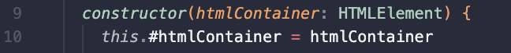

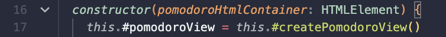

I've tryed to use longer words when developing the application. This improved the code readability and pronunceability but it also made the IDE's intellisense slower to suggest the right "word" since common words produce more matches.

## Chapter 3. Functions

Acording to Clean Code, the ideal number of arguments in a function is zero **(niladic)**. To achieve this in OOP, i've used private fields for storing values. Function calls would later not need arguments since they would instead use the value stored in the field. I'm not sure if this is a good pattern to follow and there have been cases where this solution was not posible. Nevertheless, the aplication uses at most two arguments **(monadic)**. In some instances the logic have been refactored so that the method takes **one argument that is a data structure**, instead of multiple arguments.

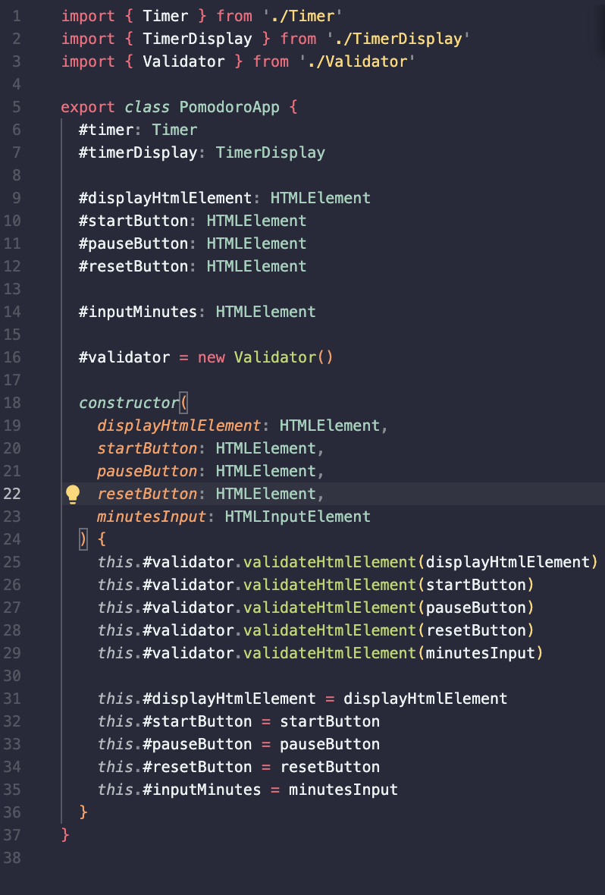

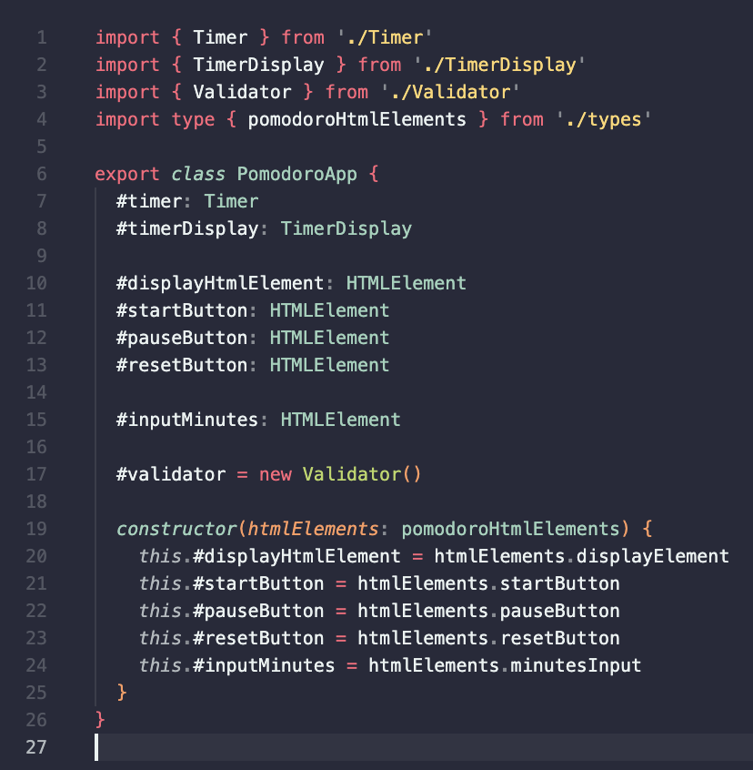

**Small function that do one thing and do it well** is the aim for function according to Clean Code. Writing a front end application in OOP has provided to be significantly more challenging than anticipated. This lead to my methods not allways following those principles. But according to Robert C. Martin, writing a funtion is like writing a paper where one first get it's thoughts down on paper and later change the wording so it reads well. Focus now for my code should be assigned in refactoring methods so that they become **smaller**, **do one thing**, **take int acount the level of abstraction** and **avoid side effects**.

The method responsable with the countdown in Timer.ts file has nested loops which according to Clean Code is a sign that a method does more than one thing. Refactoring this method had lead me to creating lesser readable code and i've choosen to stick with nested if statements since it's easyer to understand.

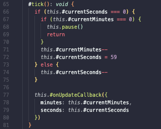

## Chapter 4. Comments

I do agree with Robert C. Martin in that **comments are often lying**. My poor current knowledge in programming leads me to refactoring of code and forgetting to change the name of variables and methods from time to time. I believe that keeping the comments updated would provide to be even less probable.

Having said that, I have used comments in my code in some areas where i stil believe they are making sense. Some example are:

- **Informative Comment** - Where typescript's intelisense would throw weird error that did not effect the code execution ::TODO:: \*ADD PRINT SCR EXAMPLE
- ** Explanation of intent** - Where calling the method would make the countdown increase it's speed. I realise that explanation of intent has to do with the reader's current knowledge. What's obvious for one developer is not that clear for another 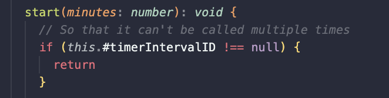
- **Banners** - The book argues that banners are in the bad category of comments, particullary when over used. I found if helpful in my html file when delimiting html templates from the rest of the html code. 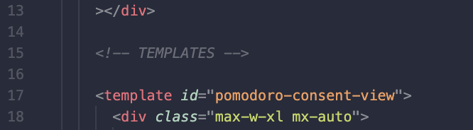

In developing the applciation, there has been an avoidance for comenting out code. Unused code has been deleted instead.

## Chapter 5. Formatting

Since the application is not that complex. An aim troughout the application developement has been to keep classes under 200 rows. This has led to a somewhat logical step in app development in breaking up the application's ui and it's logic into different classes. The breakup in different classes led to more code having to be introduced to make those classes communicate with each other but nevertheless, the class length has been keept under 200 rows.

In using the **newspaper methapo** i have placed at the top of each class the private fields of the class followed by the constructor. I believe that this convention tells the story of what the code is about.

Since public methods have **affinity**, those public methods have been placced near each other.

**Vertical openess** has been used to delimit concepts in a way that for me at least makes logic and groups different concept.

For **indentation** and **line length** i've been using prettier wich has been found to be reliable, quick and easy tool to keep my code nicely formated in the way i've setted it up. I've found that keeping the line width at 80 characters alows me to have multiple files in my IDE, side by side which halps me track and update the code in diferent files simultaniousely

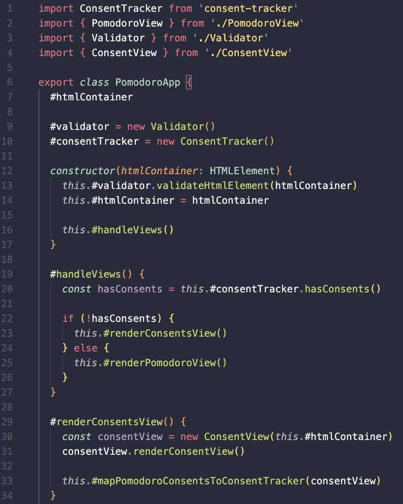

## Chapter 6. Objects and Data Structures

The distinction between data structure and object is something that i haven't give that much tought into before reading Clean Code. I've been using **hybrids**. By using typescript in my project, and converting multiple method arguments into a type, i've created **data structures/ transfer objects** while the implemented code that use those types are objects.

The law of demeter has been followed by creating instances of the object's whose methods are needed 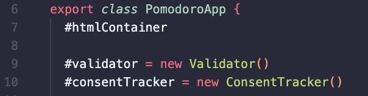

But i do violate it when handling DOM elmenets trough **train wrecks**.

## Chapter 7. Error Handling

In this project i've tried to use myself of **exceptions** (throw Error in javascript) instead of returning **null** or an arbitrary value that would signal an error. Altrough my current implementation is far from correct or complete i still believe that i learnt how to think about error handling in code.

I've choosen to follow Daniel's solution and use a single file (CustomErrors.ts), where i have different classes. I do realise that this goes against one class per file principle but i argue that the **affinity** of the different errors makes the code cleaner than having individual files for each error class.

Code implemented for error handling has been made trough an validator class that throws custom made Error objects. Because of time constraints, further improvement of the error handling has not been focused on but in future developement, one should focus on:

- Adding error traceability to **provide context** of where the error occured.
- Use try catch statements when handling methods that can throw exceptions.
- Prvide UI feedback when the user input does not pass the validation.

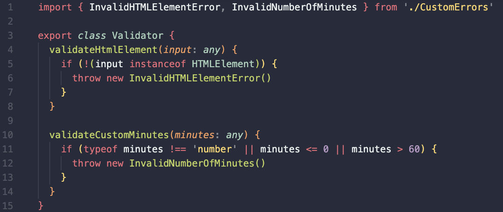

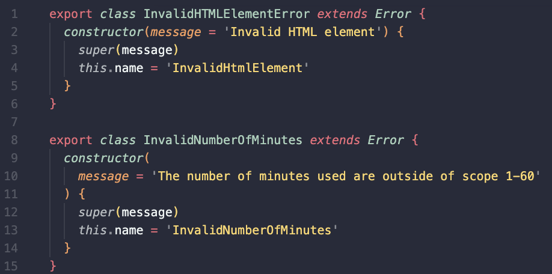

## Chapter 8. Boundaries

Since the requirement of the application is to use a third part module (consent-tracker). That module is interacting with my application trough module's **interface** but i violate the boundary principle by instantiating it in three separate classes instead of creating a ceteralized interface.

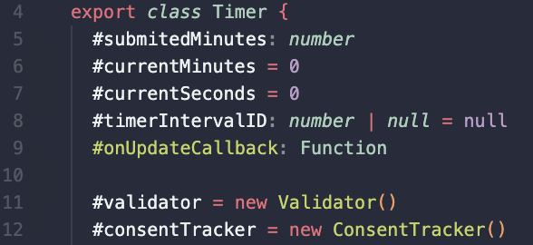

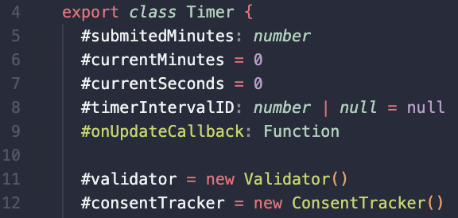

## Chapter 9. Unit Tests

Because of time constraints, no automatic tests have been created for this application. Instead manual tests that i am acustomed to have been created.

I/ we have been introduced to test driven developmenet (TDD) in earlyer courses but haven't had time neither then nor now to follow it yet. It sounds like a interesting way of creating systems and i look forward for aplying the the principles from Clean Code into next course. I do agree with the book's take on **writing readable tests**. And i do also understand that complex systems become scarry to change because of introducing new bugs so it seems like tests are a big part of a application.

Moving forward i will try to remember to write easy readable tests and apply the **FIRST** rules where the tests should be fast, run independently of each other, be repeatable, self validating and written timely.

Eearlyer attempts at creating tests have lead to having complex tests and i suspect it had to do with long function and classes. I look forward to see how writing cleaner code would ease test development

## Chapter 10. Classes

Chapter 10 felt more like a repetition of earlyer chapters, arguing about a good intent revealing naming of classes, that classes should be small which i've tried to follow.

A new way of thinkin about classes is that they should have a **single responsability principle (SPP)**. An attempt at applying SPP has ben made trough applying **MVC** where i have classes for views, classes for controller and model. The problem with the application in it's current development point is that the PomodoroView.ts handles two views and thus violates SPP. If the user consents to marketing ads, it renders an ad banner, otherwise it does not render the banner. This makes the class a controller itself as well. Instead, a new view should have been introduced for the ad banner. Beacuse of time constraints, this has not been done before deadline.

As i understand, having a big number of class variables is a sign that the class should be broken into diferent classes which i agree and makes sense in my PomodoroView file.

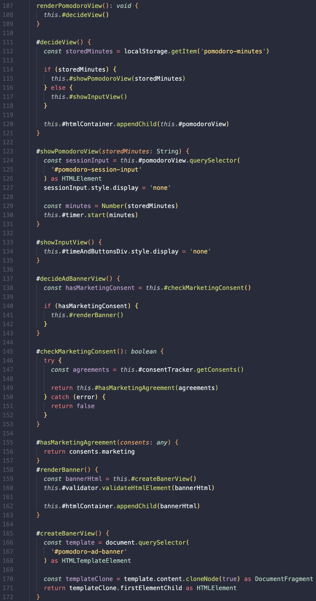

## Chapter 11. Systems

The chapter focuses on building big systems that are sustainable. As earlyer stated, i've tryed to apply **Separate Constructing a System from using It** by starting applying MVC in my application. This makes introduction of newer views easy to implement and thus easyer to scale up.
A better way accesing the `consentTracker` and `validator` instances would have been to create them in main.ts file and pass it to the application trough **dependency injection**. This would make my application to use a single instance of the object and allow tests to be more extensive by using mock instances.
