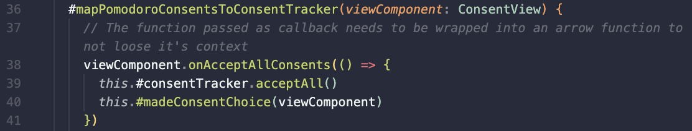

# Requirements:

Skriv en kort (4-6 meningar) reflektion för varje kapitel om hur just det kapitlet har påverkat eller inte påverkat din kod. Använd bokens termer. Ge exempel med läsbara screenshots från er kod till varje reflektion

## Chapter 1. Clean Code

According to Robert C. Martin, developers can be really productive initially, even if "bad code" is used but that bad code will slow development further down the line since that code would be at the core of the system and more and more time would be required to be allocated in understand the bad code.

This is something that has resonated with me trough my project. I've found it particularly challenging and unfamiliar to write front end application trough OOP which led me to some "unwise" architectural decisions in the early development. For example, I've kept too much logic in a single class that handled the entire front-end that I would later had to refactor by breaking the app's front end logic into different classes.

## Chapter 2. Meaningful Names

Finding **intention revealing names**, that are neither **disinformative**, **cute** nor **uninformative** has been challenging and took some time. Furthermore, what feels like a good name at one moment can make little to no sense at a later time. Variable, method and class **names have been changed** constantly throughout the development of the application when newer, better names were discovered.

Trough the development of the application, active thought about using **nouns as variable names** and **verbs as method names** has been made. I attempted for keeping **one word** per concept but a common problem that I stumbled upon is that I'm not always sure how some methods would be implemented, which later leads to refactoring of method's logic but forgetting to update the method's name.

I've tried to use longer and more descriptive words when developing the application. This improved the code readability and pronounceability but it also made the IDE's intellisense slower to suggest the right "word" since common words produce more matches.

## Chapter 3. Functions

According to Clean Code, the ideal number of arguments in a function is zero **(niladic)**. To achieve this in OOP, I've used private fields for storing values. Function calls would later not need arguments since they would instead use the value stored in the fields. I'm not sure if this is a good pattern to follow and there have been cases where this solution was not possible. Nevertheless, the application uses at most two arguments **(monadic)**. In some instances the logic have been refactored so that the method takes **one argument that is a data structure**, instead of multiple arguments.

**Small function that do one thing and do it well** is the aim for function according to Clean Code. Writing a front end application in OOP has provided to be significantly more challenging than anticipated. This lead to my methods not always following those principles. But according to Robert C. Martin, writing a function is like writing a paper where one first get it's thoughts down on paper and later change the wording so it reads well. My focus now should be refactoring methods so that they become **smaller**, **do one thing**, **take into account the level of abstraction** and **avoid side effects**.

The method responsable with the countdown in Timer.ts file has nested loops which according to Clean Code is a sign that a method does more than one thing. Refactoring this method had lead me to creating complex solution that have lesser readable code. I've chosen to stick with nested if statements since the code is easier to understand.

## Chapter 4. Comments

I do agree with Robert C. Martin in that **comments are often lying**. My poor current knowledge in programming leads me to refactor code and occasionally forget to update variable and methods names. I believe that keeping comments updated would prove to be even less likely.

Having said that, I have used comments in my code in some areas where I still believe they are making sense. Some example are:

- **Informative Comment** - Where some methods lose context and have to bind the context 
- ** Explanation of intent** - Where calling the method would make the countdown increase it's speed. I realize that explanation of intent has to do with the reader's current knowledge. What's obvious for one developer is not as clear for another 
- **Banners** - The book argues that banners are in the bad category of comments, particularly when over used. I found if helpful in my html file when delimiting html templates from the rest of the html code. 

In developing the application, I have avoided commenting out code. Unused code has been deleted instead.

## Chapter 5. Formatting

Since the application is not that complex. An aim throughout the application's development has been to keep classes under 200 rows. This has led to a somewhat logical step in app development in breaking up the application's ui and its logic into different classes. The breakup in different classes required more code to make those classes communicate with each other but nevertheless, the class length has been kept under 200 rows.

In using the **newspaper methapor** I have placed at the top of each class the private fields of the class followed by the constructor. I believe that this convention tells the story of what the code is about.

Since public methods have **affinity**, those public methods have been placed near each other.

**Vertical openess** has been used to delimit concepts in a way that for me at least makes logic and groups different concepts logically.

For **indentation** and **line length** I've been using prettier which has proven to be reliable, quick and easy tool to keep my code nicely formated in the way I've seted it up. I've found that keeping the line width at 80 characters allows me to have multiple files in my IDE, side by side which helps me track and update the code in different files simultaneously.

## Chapter 6. Objects and Data Structures

The distinction between data structure and object is something that I haven't given that much thought to before reading Clean Code. I've been using **hybrids** earlier in application developments. By using typescript in my project, and converting multiple method arguments into a type, I've created **data structures/ transfer objects** while the implemented code that use those types are objects.

The law of Demeter has been followed by creating instances of the object's whose methods are needed 

However I do violate it when handling DOM elmenets trough **train wrecks**.

## Chapter 7. Error Handling

In this project I've tried to use **exceptions** (throw Error in javascript) instead of returning **null** or an arbitrary value that would signal an error. Although my current implementation is far from correct or complete I still believe that I learnt how to think about error handling.

I've chosen to follow Daniel's solution and use a single file (CustomErrors.ts), where I store different classes. I do realize that this goes against one class per file principle but I argue that the **affinity** of the different errors makes the code cleaner than having individual files for each error class.

Code implemented for error handling has been made trough an validator class that throws custom made Error objects. Because of time constraints, further improvement of the error handling has not been focused on but in future development, one should focus on:

- Adding error traceability to **provide context** of where the error ocured.
- Use try catch statements when handling methods that can throw exceptions.
- Provide UI feedback when the user input does not pass the validation.

## Chapter 8. Boundaries

Since the requirement of the application is to use a third part module (consent-tracker). That module interacts with my application through the module's **interface** but I violate the boundary principle by instantiating it in three separate classes instead of creating a ceteralized interface.

## Chapter 9. Unit Tests

Because of time constraints, no automatic tests have been created for this application. Instead manual tests that I am accustomed to have been created.

I/ we have been introduced to test driven development (TDD) in earlier courses but haven't had time neither then nor now to follow it yet. It sounds like a interesting way of creating systems and I look forward for applying the the principles from Clean Code into the coming course. I do agree with the book's take on **writing readable tests**. I also understand that complex systems become scary to change because of the risk of introducing new bugs. It indeed seems like tests are a big part of a application.

Moving forward I will try to remember to write **easy readable tests** and apply the **FIRST** rules where the tests should be fast, run independently of each other, be repeatable, self validating and written in a timely manner.

Earlier attempts at creating tests have lead to having complex tests and I suspect it had to do with long function and classes. I look forward to seeing how writing cleaner code would ease test development.

## Chapter 10. Classes

Chapter 10 felt more like a repetition of earlier chapters, arguing about a good intention revealing naming of classes and that classes should be small which I've tried to follow.

A new way of thinking about classes is that they should have a **single responsibility principle (SPP)**. An attempt at applying SPP has ben made through applying **MVC** where I have classes for views, classes for controllers and models. The problem with the application at it's current development is that the PomodoroView.ts handles two views and thus violates SPP. If the user consents to marketing ads, it renders an ad banner, otherwise it does not render the banner. This makes the class a controller itself as well. Instead, a new view should have been introduced for the ad banner. Because of time constraints, this has not been done before deadline.

As I understand, having a big number of class variables is a sign that the class should be broken into different classes which I agree and makes sense in my PomodoroView file.

## Chapter 11. Systems

The chapter focuses on building big systems that are sustainable. As earlier stated, I've tried to apply **Separate Constructing a System from using It** by starting applying MVC in my application. This makes introduction of new views easy to implement and thus easier to scale up.

A better way of accessing the `consentTracker` and `validator` instances would have been to create them in main.ts file and pass it to the application trough **dependency injection**. This would make my application to use a single instance of the object and allow tests to be more extensive by using mock instances.
